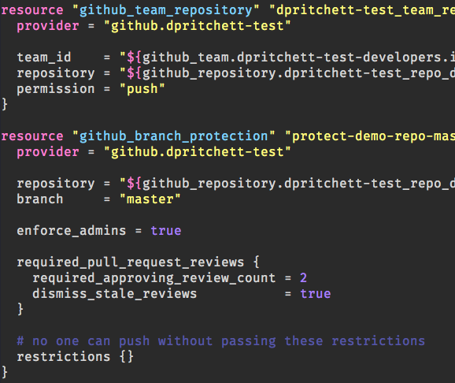
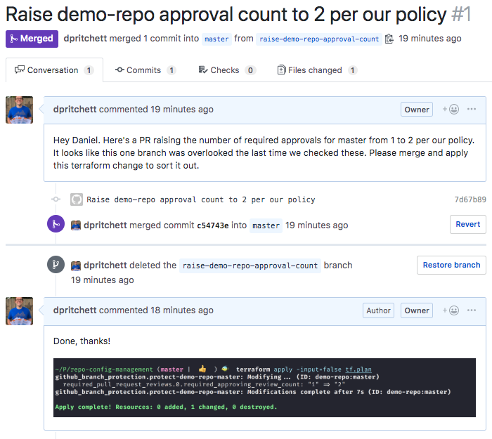
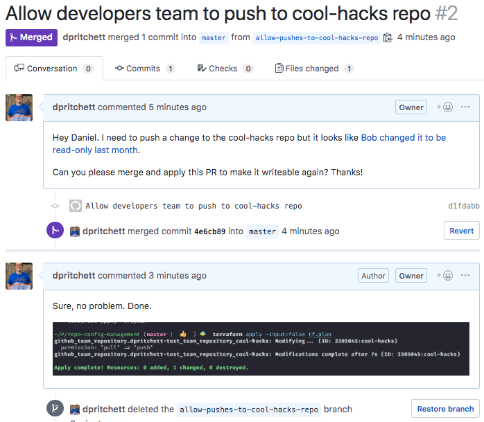

# Manage and configure GitHub repositories and user acccess with Terraform

Infrastructure-as-code configuration management for some of the public GitHub resources I administer.

 

## Big Reasons for Managing Repositories with Code

### Transparency and improved customer service outcomes

Managing non-sensitive GitHub configuration via terraform makes your GitHub settings viewable by users who don't need admin accounts. This makes for much quicker customer service and less time asking admin users to look things up.

#### Scenario: Non-admin user wants to tweak branch protections

##### Before infrastructure-as-code

> You: Hey Daniel what are the branch protections for branch X? I was hoping to ask you to change them.

> ... time passes ...

> Me: Oh it's set to 1 required approval.

> You: Oh. We need to set that to 2 approvals for security reasons. Can you please change it for me?

> ... time passes ...

> Me: Done!

> You: Ok great, thanks.

##### After infrastructure-as-code

You see the problem, locate the relevant config file, and submit a documented PR requesting the change.

I merge the PR and apply the change locally using the privileged access you don't need.

([Link to PR](https://github.com/dpritchett/repo-config-management/pull/1))

### Detailed automated change auditing and rollbacks

When all of your config changes are done through a `git` repo, tracking who changed what (and when, and why) becomes very straightforward. This makes for more empowered and informed end users.

#### Scenario: Non-admin user wants to make a repository writeable for their user group

##### Before infrastructure-as-code

> You: Hey Daniel. I noticed the `cool-hacks` repo has been set to read-only even though we still need to use it. Can you help me figure out why it was changed and help me make it writeable again?

> Me: Not sure what happened there. I think Bob was cleaning up some repos last month. I've gone ahead and made it writeable again.

> You: Thanks!

##### After infrastructure-as-code

You see the problem, click through to figure out who introduced it and when, and submit a documented PR to correct it.

I merge the PR and apply the change locally using the privileged access you don't need.

([Link to PR](https://github.com/dpritchett/repo-config-management/pull/2))

## HOWTOS

- [Import an existing repo](./doc/import-resource.md)
- [Manage user membership to organizations and teams](doc/manage-memberships.md)
- [Change the name of a terraform resource](doc/rename-tf-resource.md)
